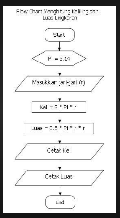
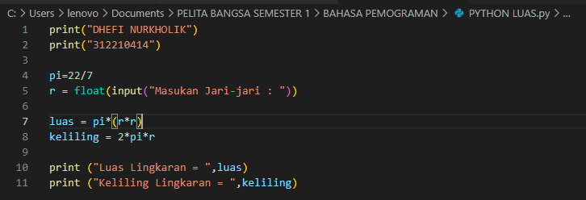
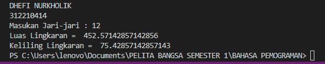

# Praktikum3
## Membuat Program Menghitung Luas dan Keliling Lingkaran
### Flowchart Luas dan Keliling Lingkaran
 
### Buat File Python Terlebih Dahulu
Langkah pertama buat rumus luas dan keliling lingkaran 
Luas = pi x r x r 
Keliling = 2 x pi x r 
ikuti code python seperti dibawah ini 
 
Hasil setelah di Run Programnya 
 
SELESAI.